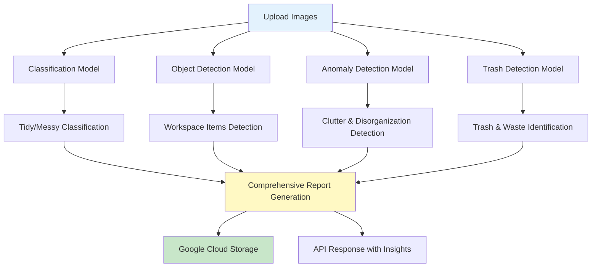

# 💻 UrDesk - AI-Powered Workspace Analysis System

**Real-time workspace monitoring system using multi-model deep learning architecture for comprehensive desk condition assessment**

UrDesk leverages four specialized computer vision models to analyze workspace cleanliness, organization, and ergonomics, providing actionable insights to improve productivity and work environment quality.

---

## 📋 Table of Contents

- [Problem Statement](#problem-statement)
- [Solution Architecture](#solution-architecture)
- [Features](#features)
- [Model Pipeline](#model-pipeline)
- [Installation](#installation)
- [Usage](#usage)
- [Model Performance](#model-performance)
- [API Documentation](#api-documentation)
- [Project Structure](#project-structure)
- [Technologies](#technologies)

---

## 🎯 Problem Statement

Poor workspace conditions directly impact productivity, employee health, and work quality. Manual monitoring is impractical and subjective, creating challenges for:
- **Remote work management**: Ensuring proper work environment without physical supervision
- **Ergonomic compliance**: Detecting workspace hazards and clutter
- **Productivity optimization**: Identifying factors that reduce work efficiency
- **Health & safety**: Monitoring trash accumulation and desk hygiene

**Impact**: Studies show organized workspaces can increase productivity by 20-30% and reduce stress levels.

---

## 🏗️ Solution Architecture

UrDesk employs a **multi-model ensemble approach** with four specialized deep learning models:



### Pipeline Overview
1. **Image Ingestion**: Dual-angle capture (front + top view) for comprehensive analysis
2. **Multi-Model Processing**: Parallel inference across 4 specialized models
3. **Result Aggregation**: Combine predictions into actionable insights
4. **Cloud Deployment**: Serverless Google Cloud Functions with GCS integration
5. **Report Generation**: JSON report with bounded images and recommendations

---

## ✨ Features

### Core Capabilities
- **Dual-perspective analysis**: Front and top-view images for complete workspace assessment
- **Multi-class detection**: Identifies specific objects (laptops, papers, food, trash)
- **Binary classification**: Tidy vs. Messy workspace categorization
- **Anomaly detection**: Spots unusual clutter patterns and disorganization
- **Trash monitoring**: Detects food waste, paper trash, and disposable items
- **Real-time processing**: Cloud-based inference with scalable architecture

### Business Intelligence
- **Productivity scoring**: Quantifies workspace organization impact
- **Actionable recommendations**: Personalized messages based on detection results
- **Visual reporting**: Bounded box images showing detected issues
- **Trend analysis**: Track workspace conditions over time

---

## 🧠 Model Pipeline

### 1. Classification Model - Workspace Tidiness
**Architecture**: NASNetLarge (Transfer Learning)  
**Task**: Binary classification (Tidy/Messy)  
**Input**: 224x224 RGB images  
**Training**: 1,703 images (train) | 430 images (validation)

**Data Augmentation**:
- Rotation (20°), width/height shift (20%)
- Shear, zoom, horizontal/vertical flip
- Rescaling to [0,1]

**Model Structure**:
```python
NASNetLarge (pretrained ImageNet)
→ GlobalAveragePooling2D
→ Dense(1024, ReLU) + Dropout(0.2)
→ Dense(1024, ReLU) + Dropout(0.2)
→ Dense(1, Sigmoid)
```

---

### 2. Object Detection Model
**Architecture**: YOLOv8l (Large)  
**Task**: Multi-class object detection  
**Classes**: Laptop, monitor, keyboard, books, stationery, food, drinks, etc.  
**Training**: 100 epochs on custom workspace dataset

**Performance**:
- **mAP@0.5**: Configured for high-precision detection
- **Confidence Threshold**: 0.3 (adjustable)
- **Real-time inference**: ~17ms per image (GPU)

---

### 3. Anomaly Detection Model
**Architecture**: YOLOv8l (Fine-tuned)  
**Task**: Detect cluttered areas and disorganized items  
**Purpose**: Identify atypical workspace conditions affecting productivity

**Detected Anomalies**:
- Paper stacks and document clutter
- Misplaced items (food on work area)
- Cable tangles and equipment disorder
- Unusual object placements

**Performance Metrics**:
| Class | Precision | Recall | mAP@0.5 |
|-------|-----------|--------|---------|
| Makanan | 0.416 | 0.573 | 0.530 |
| Piring Bekas | 0.524 | 0.709 | 0.716 |
| Kertas | 0.459 | 0.516 | 0.475 |
| Bekas | 0.399 | 0.100 | 0.162 |

---

### 4. Trash Detection Model
**Architecture**: YOLOv8 (Custom-trained)  
**Task**: Identify waste and disposable items  
**Confidence Threshold**: 0.4 (stricter for trash)  
**Classes**: Food waste, paper trash, plastic bottles, disposable containers

---

## 🚀 Installation

### Prerequisites
- Python 3.8+
- CUDA-capable GPU (recommended)
- Google Cloud account (for deployment)
- 8GB+ RAM

### Local Setup

```bash
# Clone repository
git clone https://github.com/rioooranteai/computer-vision-object-detection.git
cd computer-vision-object-detection/Urdesk

# Install dependencies
pip install ultralytics tensorflow opencv-python numpy pillow matplotlib seaborn

# Download pre-trained models (place in Model Development folder)
# - best_model_NasnetLarge.h5
# - best-anomaly-detection.pt
# - model-5-trash-detection.pt
# - best_object_detection_model.pt
```

### Google Cloud Deployment

```bash
# Install Google Cloud SDK
gcloud auth login

# Deploy to Cloud Functions
gcloud functions deploy predict_image \
  --runtime python39 \
  --trigger-http \
  --allow-unauthenticated \
  --memory 4096MB \
  --timeout 540s
```

---

## 💡 Usage

### Local Inference (Notebook)

```python
from ultralytics import YOLO
import tensorflow as tf

# Load classification model
classification_model = tf.keras.models.load_model('best_model_NasnetLarge.h5')

# Load YOLO models
object_model = YOLO('best_object_detection_model.pt')
anomaly_model = YOLO('best-anomaly-detection.pt')
trash_model = YOLO('model-5-trash-detection.pt')

# Run inference
results = object_model('workspace_image.jpg', conf=0.3)
results.save('output_bounded.jpg')
```

### Cloud Function API

**Endpoint**: `https://YOUR_REGION-YOUR_PROJECT.cloudfunctions.net/predict_image`

**Request**:
```json
{
  "file_name": "user123_20260216"
}
```

**Response**:
```json
{
  "error": "no-error",
  "predictions": [
    {
      "poin": 1,
      "message": "Selamat! Meja kerja Anda terlihat sangat rapi...",
      "imageURL": null,
      "list_detection": "tidy"
    },
    {
      "poin": 0,
      "message": "Saya telah menandai barang-barang yang penting...",
      "imageURL": ["images/user123/predictions/object_front.jpg"],
      "list_detection": ["laptop", "keyboard", "monitor"]
    }
  ]
}
```

---

## 📊 Model Performance

### Classification Model (NASNetLarge)
- **Architecture**: 88M parameters
- **Training Time**: ~45 minutes per 100 epochs (Tesla T4 GPU)
- **Metrics**: Accuracy, Precision, Recall, AUC tracked via callbacks
- **Best Model Selection**: AUC > 0.90 and Accuracy > 0.85

### Object Detection (YOLOv8l)
- **Parameters**: 43.6M
- **GFLOPs**: 165.4
- **Inference Speed**: 17ms per image (GPU)
- **Training**: 100 epochs with AdamW optimizer

### Deployment Performance
- **Cloud Function Cold Start**: ~8-12 seconds
- **Warm Inference**: ~3-5 seconds per request
- **Concurrent Processing**: Handles multiple requests via GCS queue

---

## 🛠️ Technologies

**Deep Learning**:
- **YOLOv8**: Ultralytics framework for object detection
- **NASNetLarge**: Keras/TensorFlow transfer learning
- **EfficientNetV2L, ResNet50**: Alternative architectures explored

**Cloud Infrastructure**:
- **Google Cloud Functions**: Serverless compute
- **Google Cloud Storage**: Model and image storage
- **Cloud Build**: CI/CD pipeline

**Libraries**:
- **TensorFlow 2.4+**: Deep learning framework
- **PyTorch**: YOLO backend
- **OpenCV**: Image processing
- **NumPy, Pandas**: Data manipulation
- **Matplotlib, Seaborn**: Visualization
